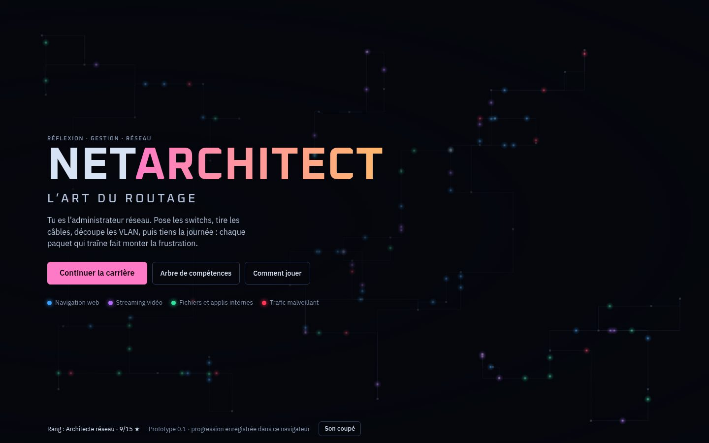
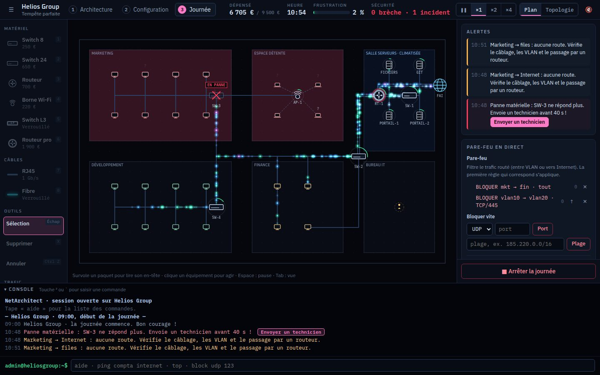
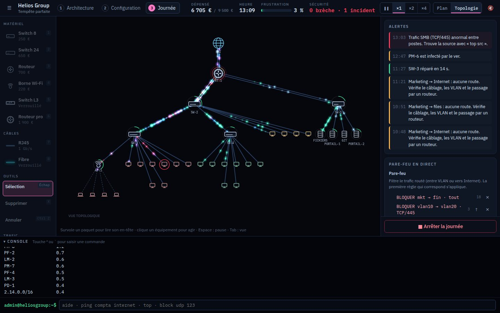
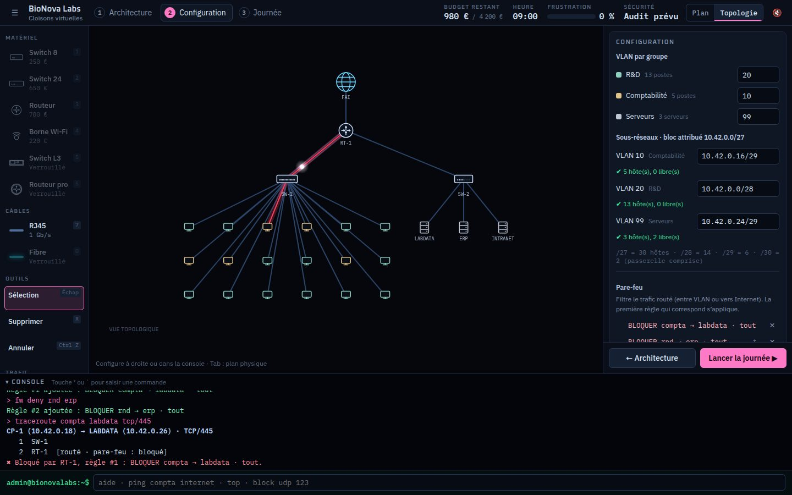

# NetArchitect : L'Art du Routage

Jeu de réflexion et de gestion réseau en 2D, entre *Mini Metro* et *Hacknet*.
Tu es l'administrateur réseau : conçois l'infrastructure d'une entreprise, configure-la,
puis tiens la journée pendant que les paquets circulent, que le matériel chauffe et que
les attaques arrivent.



Ce dépôt contient un **prototype jouable** : cinq missions de campagne, les trois phases
de jeu, les deux vues (plan physique et topologie), la console, les crises en temps réel,
l'arbre de compétences et une bande-son générée en direct.

| Plan physique pendant une panne | Vue topologique pendant l'attaque d'un ver |
| --- | --- |
|  |  |



## Jouer

Il faut Node.js 22.18 ou plus récent.

```bash
npm install
npm run dev        # serveur de développement sur http://localhost:5173
npm run build      # produit dist/index.html, un fichier unique jouable hors ligne
```

`dist/index.html` s'ouvre directement dans un navigateur, sans serveur : polices et
code sont embarqués, le jeu ne fait aucune requête réseau. La progression est enregistrée
dans le navigateur (`localStorage`).

## Contenu du prototype

**Trois phases par mission**

1. **Architecture** : pose switchs, routeurs et bornes Wi-Fi sur le plan, tire les câbles
   RJ45 (1 Gb/s, 100 m max) ou fibre (10 Gb/s), sans dépasser le budget.
2. **Configuration** : VLAN par service, découpage des sous-réseaux, règles de pare-feu,
   répartition de charge. Au formulaire ou à la console.
3. **Journée** : de 9 h à 18 h, les paquets circulent (bleu : web, violet : streaming,
   vert : fichiers, rouge : trafic malveillant). Les liens saturent, les files d'attente se
   forment, le matériel chauffe, la frustration monte.

**Cinq missions**, de la start-up au siège d'un groupe : câblage et budget, goulots
d'étranglement et chaleur, VLAN et puzzle d'adressage VLSM, répartition de charge et DDoS,
puis la « tempête parfaite » (panne matérielle, ver informatique, flood HTTP).

**Crises en temps réel** : sondes d'audit, DDoS par amplification NTP, flood HTTP d'un
botnet, ver SMB, pannes réparées par un technicien qui traverse l'étage, surchauffe.
Détails dans [docs/cyberattaques.md](docs/cyberattaques.md).

**Arbre de compétences** : fibre, switch niveau 3, routeur haute capacité, climatisation,
IDS, limitation de débit, script d'auto-mitigation, supervision SNMP, script Auto-VLAN,
répartition adaptative, second technicien.

### Contrôles

| Touche | Action |
| --- | --- |
| `1` à `6` | Choisir un équipement |
| `7` / `8` | Câble RJ45 / fibre (clic sur A puis sur B ; le tracé continue) |
| `X`, `Suppr` | Supprimer |
| `Échap`, clic droit | Revenir à la sélection |
| `Tab` ou `V` | Plan physique ⇄ vue topologique |
| `Espace` | Pause pendant la journée |
| `²` ou `` ` `` | Console |
| `Ctrl + Z` | Annuler |
| Molette, glisser, `F` | Zoom, déplacement, recadrage |

### Console

```
ping compta internet            tester un accès (le chemin s'affiche sur le plan)
traceroute compta labdata tcp/445
vlan compta 10                  mettre un groupe dans un VLAN
subnet 10 10.42.0.16/29         attribuer un sous-réseau
fw deny compta labdata          bloquer un accès
top · top src · tcpdump         analyser le trafic pendant une attaque
block udp 123 · blockip 185.220.0.0/16
quarantine pm-6 · dispatch sw-3
```

`aide` liste toutes les commandes.

## Architecture

```
src/core/     Simulation pure et déterministe : réseau, routage VLAN/L3, pare-feu à état,
              trafic, files d'attente, chaleur, frustration, incidents, console, missions.
              Aucune dépendance au DOM : elle tourne aussi dans Node pour les tests.
src/render/   Rendu Canvas 2D : caméra, vue topologique, pictogrammes, paquets additifs.
src/app/      Écrans, contrôleur de mission, panneaux, console, sauvegarde.
src/audio/    Synthwave et bruitages générés avec Web Audio.
tests/        Tests Vitest et solutions de référence des missions.
scripts/      Banc d'équilibrage.
docs/         Concept, choix du moteur, cyberattaques, systèmes.
```

Pourquoi TypeScript et le web plutôt que Godot ou Unity : voir
[docs/moteur.md](docs/moteur.md).

## Vérifier

```bash
npm run typecheck   # TypeScript strict
npm test            # 48 tests, dont une journée complète par mission
npm run balance     # rejoue chaque mission et ses variantes dégradées
```

Le banc d'équilibrage montre par exemple que ShopNow est perdue sans répartition de
charge, que BioNova subit des brèches si les règles sont posées sans VLAN, et qu'Helios se
gagne en isolant le ver même avec une réaction lente.

## Feuille de route

- **Missions « cloud »** : plusieurs sites reliés par VPN, liens WAN, cloud hybride.
- **Nouvelles crises** : amplification DNS piégée, rançongiciel et sauvegardes,
  exfiltration lente, attaques qui changent de port (pistes dans
  [docs/cyberattaques.md](docs/cyberattaques.md)).
- **Mode bac à sable** et éditeur de missions.
- **Rendu WebGL** (PixiJS) pour les très grands réseaux, simulation dans un Web Worker.
- **Distribution** : Steam via Tauri, tablettes via Capacitor.

## Documentation

- [Concept](docs/concept.md)
- [Choix du moteur](docs/moteur.md)
- [Mécaniques de cyberattaque](docs/cyberattaques.md)
- [Systèmes de simulation](docs/systemes.md)
